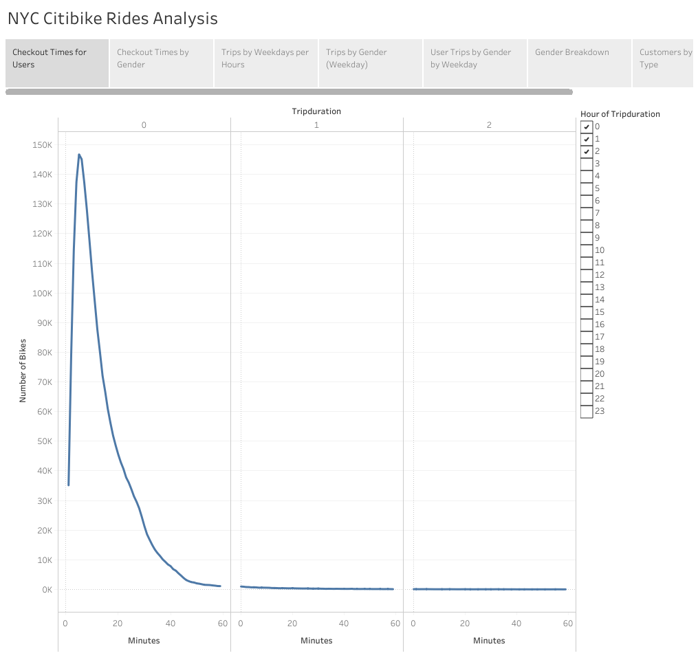
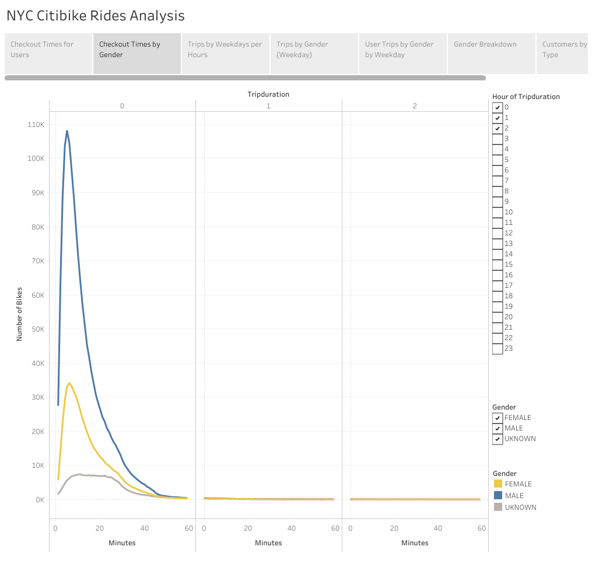
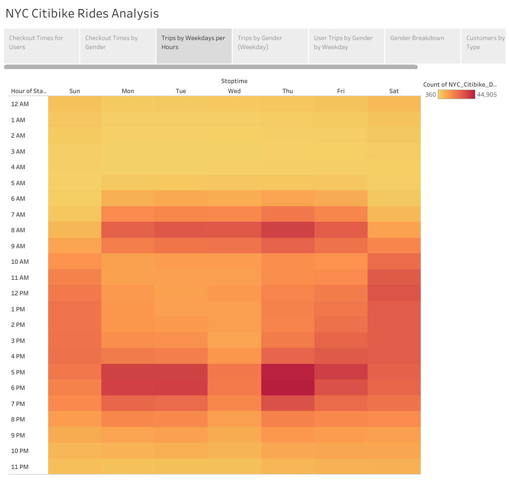
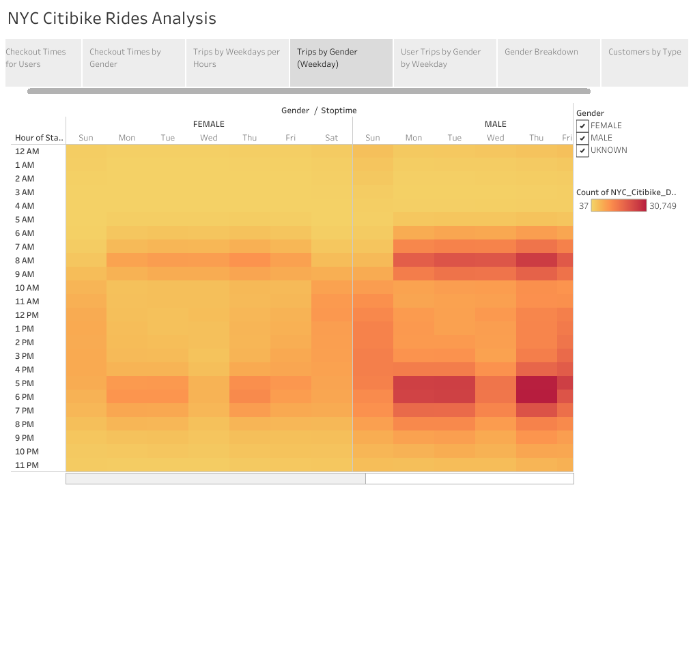
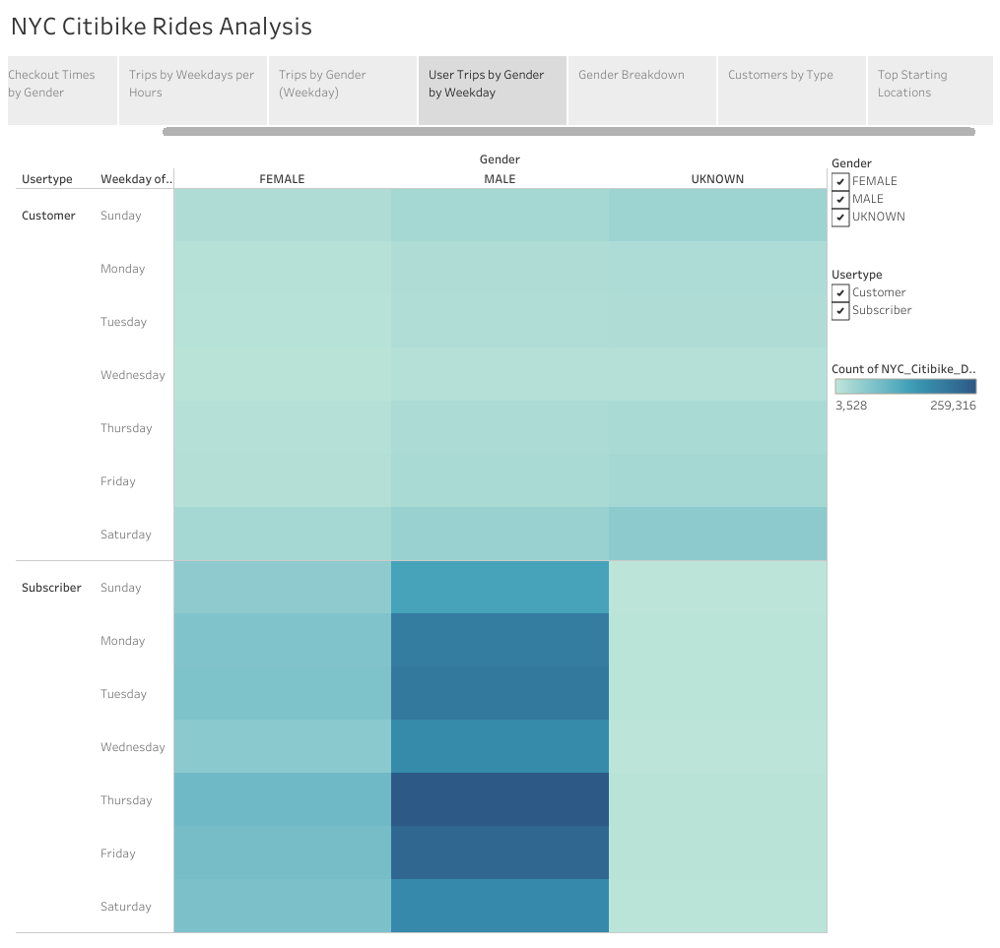
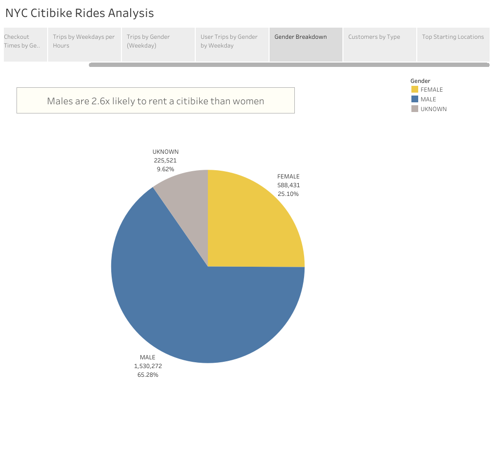
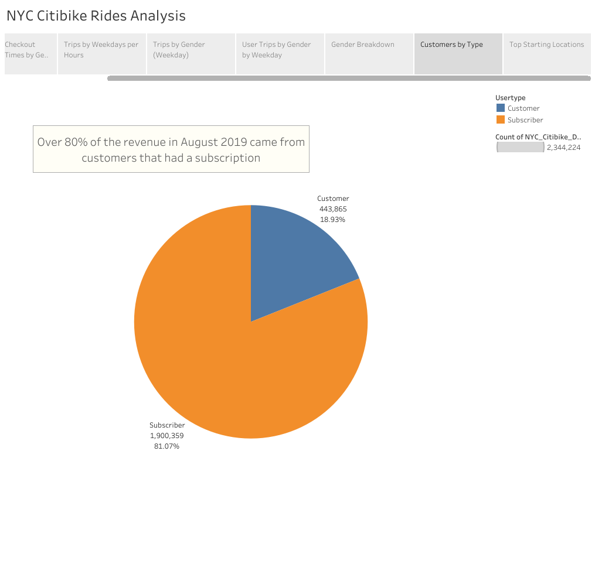
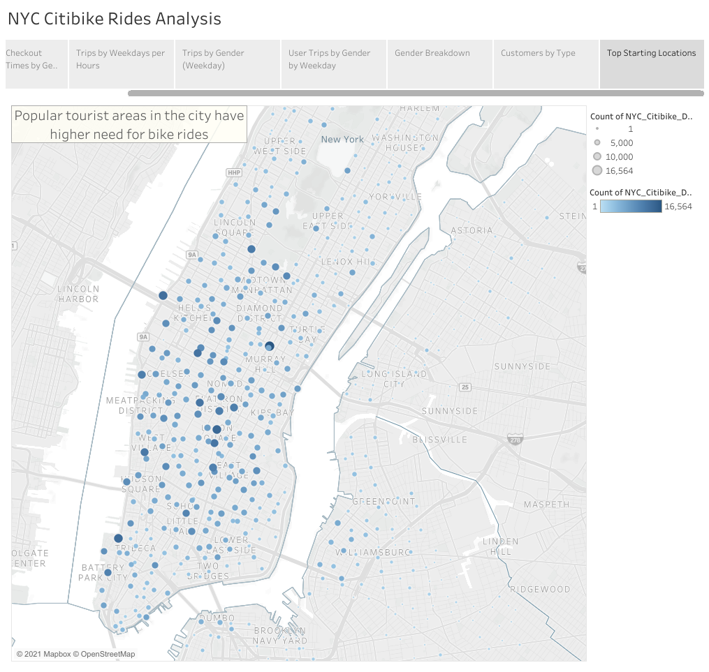

# bikesharing
Analyze Citibike data in NYC using Tableau. 

## Overview of Project
**Purpose:**
The purpose of this project is to conduct a bike trip analysis of NYC data to convince investors that a bike-sharing program in Des Moines is a solid business.

**Task:** 
To complete this project, we will use Pandas  to format our data and use Tableau to visualize and tell our story.

**Approach:**
Using Pandas to change the "tripduration" column from an integer to a datetime datatype.
Using the Tableau to create set of visualizations to communicate our findings.

**Method:** Using Python (Pandas) and Tableau.

## Resources
- Data Source: NYC_Citibike_Data_Converted (Not uploaded in GitHub due to large size); [Tableau Workbook](https://public.tableau.com/profile/monika.spiritova#!/vizhome/NYCCitibikeRidesAnalysisChallenge/Story1?publish=yes); 

- Source Code: 
    [NYC_Citibike_Challenge.ipynb](NYC_Citibike_Challenge.ipynb); 

- Programming Languages: Python
- Software: Tableau

## Results

The following Tableau workbook has been built as part of this project.

**Snapshot of final Tableau workbook**

[link to dashboard](https://public.tableau.com/profile/monika.spiritova#!/vizhome/NYCCitibikeRidesAnalysisChallenge/Story1?publish=yes "Click to go to Tableau Workbook")

### Show the length of time that bikes are checked out for all riders and genders

1) Checkout times by users
    - The the majority of bike rides range from just couple of minutes up to 40 minutes.

2) Checkout times by Gender
    - The trip duration does not seem to be dependant on the gender.

### Show the number of bike trips for all riders and genders for each hour of each day of the week

3) Trips by weekdays by hour
    - The busiest times of the week are Thursdays 5pm -6pm, followed by 5pm on Fridays and 8am on Thursdays.

  
4) Trips by gender (weekday)
    - Thursdays 5pm - 6pm are the busiest hours of the week with males being the most frequent customers. Women are also using the service between 5pm -6pm on Thursdays the most. 

### Show the number of bike trips for each type of user and gender for each day of the week.

5) User trips by gender by weekday
    - Thursdays are the busiest days followed by Fridays. Males that have subsription are the most frequent customers.

### Summary Statistics Overview

6) Gender breakdown
    - Males are 2.6x likely to rent a citibike than women

7) Customers by type
    - Over 80% of the revenue in August 2019 came from customers that had a subscription

8) Top starting locations
    - Popular tourist areas in the city have higher need for bike rides

## Summary
- Males are more likely to use bike ride services (2.6x) than women
- Majority of the bike rides are being used by customers that are subscribed to the services (~ 80%)
- Thursdays 5pm - 6pm are the busiest times
- Areas that are popular tourist spots see higher need for bike ride service

*Other visualizations to create to get more insight:*
- Number of bike rides by gender and age 
- Age vs. customer type vs. gender to see if there is any correlation
